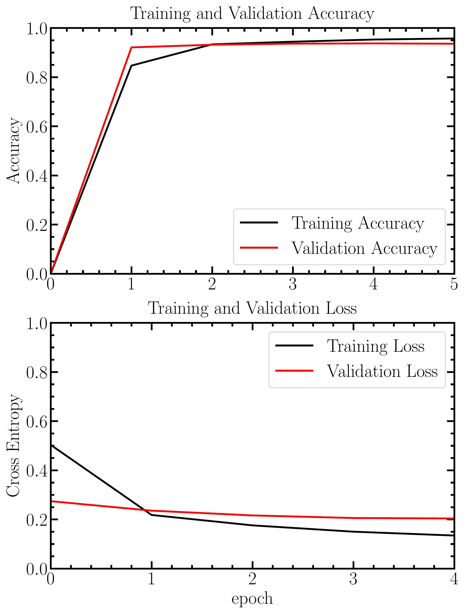

<h1 align=center style=""> Photos Classifier  </h1>
    <blockquote> 
        The goal of this project is to classify camera photos using transfer learning from mobileNetV2 trained on imagenet. Each photo is labeled (in its exifs) with one class among 10 possible: 
        <ul>
            <li> Animal
            <li> Architecture
            <li> Astrophotography
            <li> Landscape
            <li> Macrophotography
            <li> Portrait
            <li> Sport
            <li> Still Life
            <li> Street Photography
            <li> Transport
        </ul>
    </blockquote>

## Dataset
The dataset was built using a Flickr API (`flickr.py`).
To execute the script:
```
python3 flickr.py search_term class_folder number_photos_to_retrieve
```

Initially $20000$ photos were gathered with this method and after cleansing misclassified and corrupted photos, the dataset was composed of $14737$ photos.

A 80-20 repartition is used to form the training and validation set, respectively. 

## Model training
The base model is MobileNetv2 trained on imagenet (choosed for its lightweightness, running well on a laptop without GPU).
The weights are freezed and the head added is a softmax.
 
 The training steps are presented in `Classifier_training.ipynb`.
 
 The trained model is in the folder `photos_classifier`.
<p align="center">

<p align="center"> Accuracy and Loss evolution of the training and validation sets </p>
</p>

## Application

The model can then be applied on a folder (*folder_name*)using 
```
python3 set_category folder_name
```

The predicted category is written in the exif column *Description*.

